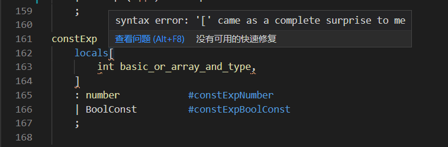

# 编译原理研讨课实验PR001实验报告

## 任务说明
本次实验为 CACAT 的第一个实验，主要需要完成两个任务：
* 熟悉 Antlr 的安装和使用：在课堂上完成，使用 VSCode 远程连接至本组的服务器并安装实验说明逐步安装配置即可；
* 完成词法和语法分析：在课下完成，需要根据 CACT 文法规范编写 `.g4` 文件，并使用 Antlr 生成词法分析器（lexer）和语法分析器（parser）对原代码进行词法、语法分析，同时需要对语法、词法错误能进行相应的处理（符号规范的 `.cact` 文件返回 0，有错误的则返回非 0 值）。

## 成员组成
* 徐泽凡 2018K8009929037
* 闫文凯 2018K8009910009

## 实验设计

### 设计思路
本次实验的代码部分主要分为规则文件的设计以及文法错误处理的设计。

对于规则文件，本次实验已经给出了一份 CACT 语言规范，只需要将原规则文件中缺少的部分根据语言规范进行补充即可，对于语言规范中未提到的浮点数部分，可根据给出的整型常数自行设计补充。

对于语法错误处理部分，Antlr 生成的词法、语法分析器提供了错误计数器和处理错误的接口，只需要在正确的地方捕捉错误并进行处理即可。

### 实验实现
对于规则文件，需要补充浮点数部分的设计，由于在 CACT 中，浮点型字面值为 `double` 与 `float` 类型，其中 `float` 型字面值后面需跟 F 或 f 后缀，因此可以据此入手来书写浮点数的规则：

```Antlr
floatConst
    : doubleConst ('F' | 'f')
    ;

doubleConst
    : ExpNum
    | NonExpNum
    ;
```

其中将浮点数的表示分为指数形式 `expNum` 以及普通形式 `nonExpNum` ，对于指数形式，其包括基数、指数符号、指数三个部分，基数部分为一串数字以及一个可能出现在任何地方的小数点构成，指数符号则为 E 或 e，指数部分为 可能的 +、- 符号以及一串数字组成；普通形式则与指数形式的基数部分类似，只是小数点必须出现即可，具体设计如下：

```Antlr
fragment
ExpNum
    : Base Index
    ;

fragment
Base
    : '.' (Digit)+ 
    | (Digit)+ '.'
    | (Digit)+ '.' (Digit)+
    | (Digit)+
    ;

fragment
Index
    : ('E' | 'e') ('+' | '-')? (Digit)+
    ;

fragment
NonExpNum
    : '.' (Digit)+
    | (Digit)+ '.'
    | (Digit)+ '.' (Digit)+
    ;

```

对于错误处理部分，首先需要考虑的是如何获取错误信息。`CACTLexer` 的父类 `antlr4::Lexer` 和 `CACTParser` 的父类 `antlr4::Parser` 均提供了 `getNumberOfSyntaxErrors` 方法，通过他们可以获取词法和语法分析过程中出现的错误数量，再根据错误数量进行正确的处理。那么很容易写出处理错误的代码：
```c++
if (lexer.getNumberOfSyntaxErrors() > 0)
{
    std::cout << "Error: There is " << lexer.getNumberOfSyntaxErrors() 
            << " syntax errors reported by lexer." << std::endl;
    return 1;
}
if (parser.getNumberOfSyntaxErrors() > 0)
{
    std::cout << "Error: There is " << parser.getNumberOfSyntaxErrors() 
            << " syntax errors reported by parser." << std::endl;
    return 1;
}
```

其次需要考虑的是，错误处理代码应该放在哪里。通过阅读实验框架给出的编译器主函数，在分析每一条语句的作用后，我们将错误处理代码放在了下面所示的位置：

```c++
int main(int argc, const char* argv[]) {
    std::ifstream stream;
    stream.open(argv[1]);                                   // open source file
    ANTLRInputStream input(stream);                         // input source file
    CACTLexer lexer(&input);                                // build lexer
    CommonTokenStream tokens(&lexer);                       // build tokens
    CACTParser parser(&tokens);                             // build parser

    tree::ParseTree *tree = parser.compUnit();              // generate tree

    // Insert the error handling code here

    SemanticAnalysis listener;
    tree::ParseTreeWalker::DEFAULT.walk(&listener, tree);   // walk the tree for next step
    
    std::cout << "debug: hello" << std::endl;


    std::cout << "------------Print AST:------------" << std::endl;
    std::cout << tree->toStringTree(&parser) << std::endl;

    return 0;
}
```

即词法、语法分析器解析源代码之后，遍历抽象语法树之前。`parser.compUnit()` 一句才开始分析源代码构造语法树，在解析此之前捕捉不到错误（踩过坑）；遍历错误的语法树可能会使编译器发生段错误而原地爆炸（踩过坑）。

### 其它
#### 遇到的错误
在实验中，我们遇到了看起来较为奇怪的错误，如下图所示：



This error also came as a complete surprise to us. 我们对这个报错完全摸不着头脑，尝试了很长时间也没有找到该报错对应的解决方案。最后在与同学的交流以及对 ppt 的复看中得知，可能是错将 parser 部分的规则名首字母大写，在修改后这一报错消失。

#### 对工程框架的完善
虽然工程框架已经通过 cmake、make 等工具管理了编译过程，但在编译、调试、测试的过程中还是有许多不大方便的地方。本着磨刀不误砍柴工的想法，我们补充了一些脚本：
* 工程根目录下的 `Makefile`：作为入口，用于便捷启动各个部分的脚本。
* `grammar` 目录下的 `Makefile`：用于运行 Antlr4，根据 `.g4` 文件生成词法和语法分析器。
* `samples` 目录下的 `test.sh`：用于批量执行测试，并将测试结果写回到 `output.txt` 文件中。

其中在编写 `grammar` 目录下的 `Makefile` 时，我们遇到了一些困难。我们平时使用命令行调用 `antlr4` 命令，使用的是 `alias` 定义的别名，但这个别名对 `make`、`bash` 之类的脚本都没有效果。经过一番探索，我们发现既然它是别名，不如直接将“本名”作为一个变量写入 `Makefile`，然后再通过变量调用它，成功的解决了问题。

```Makefile
# Makefile for antlr
ANTLR4 = java -Xmx500M -cp "/home/compiler13/lib/antlr-4.8-complete.jar:${CLASSPATH}" org.antlr.v4.Tool 
GRUN = java -Xmx500M -cp "/home/compiler13/lib/antlr-4.9-complete.jar:${CLASSPATH}" org.antlr.v4.gui.TestRig
GRAMMER_FILE = CACT.g4

all: CACT.g4
	@echo "Generating lexer and parser code..."
	@echo "antlr4 -Dlanguage=Cpp ${GRAMMER_FILE}"
	@${ANTLR4} -Dlanguage=Cpp ${GRAMMER_FILE}

.PHONY : all
```

## 总结

### 实验结果总结
按照上述内容完成的语法规则文件和编译器源码，经过编译、测试，能够正确的报出源程序中的语法错误，并给出正确的返回值。

经过实验，我们掌握了 Antlr 的基本使用方法，同时也感觉到它的强大。通过阅读 Antlr 生成的词法、语法分析器的源码，并参考其文档，我们大致理解了它们的工作逻辑，也对整个编译过程和下一步的工作有了一个大概的认识。

### 分成员总结

#### 闫文凯
主要完成了语法规则文件的书写。

该部分的内容与理论课有着较大的关联，有着理论课的基础以及较为详细的文法规范，设计出浮点数的文法并不困难。设计好文法以后根据正则表达式的规范将其合法地写入 `CACT.g4` 即可。对于 debug 过程，可以根据错误的产生位置来对规则文件进行修改。

#### 徐泽凡
主要完成了错误处理部分，补充了部分脚本。

在实验中，我用到了很多此前掌握的技能，包括 C++、面向对象、`Makefile`、`bash` 等等。就算有些内容遗忘了，也可以通过翻手册很快找到。这些此前积攒下的技能帮了我很多忙，也让我把更多的精力放在理解、设计编译器上。同样地，使用这些技能的过程，也进一步提升了它们熟练度。

实验一的内容相对简单，我们也还没有开始下一步的工作。但是，在实验中我们也注意到一些问题，比如：
* `if`、`else`、`while`、`for` 之类的控制语句全部写在一条解析规则中是否合适？将它们拆分是否会方便后续生成中间代码？
* `int`、`if`、`const` 之类的关键字是否需要首先创建一套 `INT`、`IF`、`CONST` 这样的单一词法规则？
* 数组的声明、使用是否需要独立的解析规则？

在后续的实验中也许我们能够得出答案。